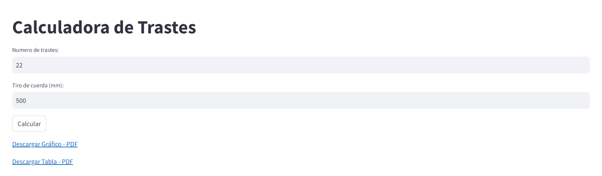
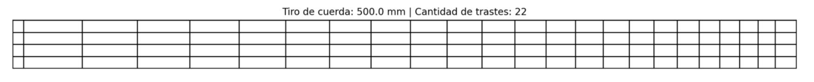
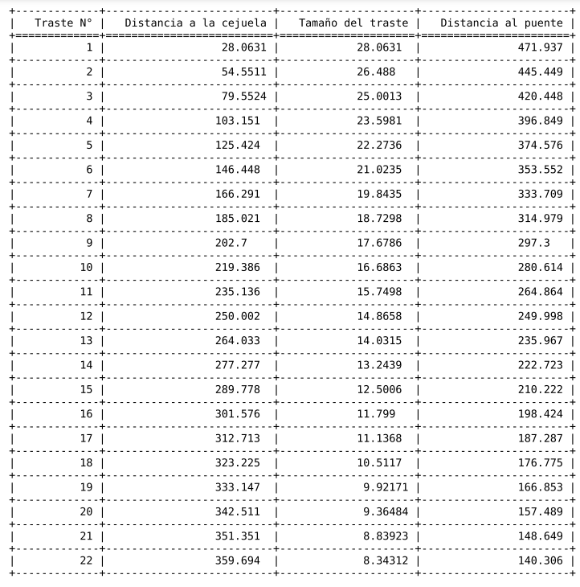

# Calculadora de Trastes

<div style="display: flex; align-items: center;">
  <a href="https://calculadora-de-trastes.streamlit.app/">
    
  </a>
  <span style="font-size: 15px; margin-left: 10px;">Este es un proyecto desarrollado para la Escuela de Luthería "El Taller de Boedo"</span>
</div>



## Índice

- [Descripción](#descripción)
- [Instrucciones de Uso](#instrucciones-de-uso)
- [Instrucciones de instalación](#instrucciones-de-instalacion)
- [Tecnologías Utilizadas](#tecnologías-utilizadas)
- [Agradecimientos](#agradecimientos)
- [Contacto](#contacto)

## Descripción

Esta es una aplicación simple que te permite calcular la ubicación de los trastes en un diapasón de guitarra bajo el contexto de luthería. Simplemente ingresa el número de trastes y el tiro de cuerda en milímetros, y la aplicación generará un gráfico con la ubicación de los trastes y una tabla con detalles específicos.



## Instrucciones de Uso

1. Ingresa el número de trastes que deseas calcular en el campo "Número de trastes".

2. Ingresa el tiro de cuerda en milímetros en el campo "Tiro de cuerda (mm)".

3. Haz clic en el botón "Calcular".

4. La aplicación generará un gráfico que muestra la ubicación de los trastes en el diapasón, así como una tabla con detalles específicos, como la distancia desde la cejuela y el tamaño de cada traste.

5. Puedes descargar el gráfico y la tabla en formato PDF utilizando los enlaces proporcionados.



## Instrucciones de Instalación

Para ejecutar esta aplicación, sigue estos pasos:

1. Clona o descarga el repositorio desde GitHub. Puedes hacerlo ejecutando el siguiente comando en tu terminal:

   ```bash
   git clone https://github.com/claudiacaceresv/calculadora_de_trastes_luthier.git
   ```

2. Navega al directorio del proyecto:

   ```bash
   cd calculadora_de_trastes_luthier
   ```

3. Opcional: Crea y activa un entorno virtual para aislar las dependencias del proyecto. Puedes hacerlo utilizando los siguientes comandos:

   - En Linux/macOS:

   ```bash
   python -m venv venv
   source venv/bin/activate
   ```

   - En Windows:

   ```bash
   python -m venv venv
   venv\Scripts\activate
   ```

4. Instala las dependencias desde el archivo requirements.txt:

   ```bash
   pip install -r requirements.txt
   ```

5. Una vez que todas las dependencias se hayan instalado, puedes ejecutar la aplicación con Streamlit:
   ```bash
   streamlit run app.py
   ```

## Tecnologías utilizadas

Esta aplicación fue desarrollada utilizando las siguientes tecnologías y bibliotecas:

- **Python**: Lenguaje de programación en el que se escribió la aplicación.
- **Streamlit**: Biblioteca de Python para crear aplicaciones web interactivas con facilidad.
- **Pandas**: Biblioteca de Python para el análisis de datos y manipulación de DataFrames.
- **Matplotlib**: Biblioteca de Python para crear gráficos y visualizaciones.
- **tabulate**: Biblioteca de Python para formatear tablas a partir de DataFrames.
- **io** y **base64**: Bibliotecas estándar de Python para trabajar con datos binarios y codificación Base64.

## Agradecimientos

Agradezco a la **Escuela de Luthería "El Taller de Boedo"** por permitirme compartir esta aplicación y el código para uso público. Puedes encontrar más información sobre la escuela en su [Instagram](https://www.instagram.com/el_taller_de_boedo/).

## Contacto

**Claudia Caceres**  
_Data Scientist | Data Analyst_

[](https://www.linkedin.com/in/claudiacaceresv/)
[](https://github.com/claudiacaceresv)
[](https://t.me/claudiacaceresv)
[](https://api.whatsapp.com/send?phone=541124831343)
[](mailto:claudiacaceres.info@gmail.com)

---

**Descargo de Responsabilidad**:
_Esta aplicación y el código fuente fueron desarrollados por Claudia Caceres._
_Puedes visitar la aplicación en [https://calculadora-de-trastes.streamlit.app/](https://calculadora-de-trastes.streamlit.app/). El código fuente está disponible en este repositorio para su uso público._
# calculadora_de_trastes
